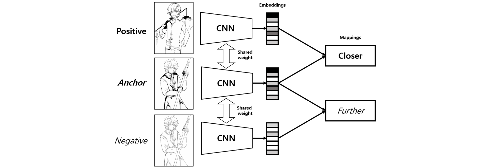

# Greyscale Image Processor (Sketch Generator)

This repository takes an image as input and outputs a greyscale "sketch" of the image. It provides a Gradio based Ui and FastApi jobScheduler endpoint.

## Features

- Converts the image to a greyscale sketch.
- Downloads processed images as a ZIP file.
- Gpu docker container setup and docker compose networking
- job Scheduler using Celery, Redis and FastApi 
- Gradio Ui for quick testing

# Architecture




# Ui Sample

## Gradio_Ui samples


# Flask-endpoint API Endpoints

## 2. `/process` (POST)

- **Description**: Accepts an image file, processes it, and returns a URL to download the resulting `.zip` file.
- **Request**:
  - **Method**: `POST`
  - **Body**: `{"imageUrl": "https://example.com/image.jpg"}`
- **Response**:
  ```json
  { "zipFileUrl": "/download/<generated-zip-file-name>.zip" }
  ```

## Source

This repository is a clone of [https://github.com/Chanuku/semi_ref2sketch_code](https://github.com/Chanuku/semi_ref2sketch_code).

# Dependent services

**This must be in docker-compose.yml other can be commented out**

- image2sketch-job-scheduler
- image2sketch
- image2sketch_network

# How to Run

`docker-compose up --build`

# How to use gradio_ui

- Run UI at `http//:localhost:8073`
- Past the link of the image you want to process in the `ImageURL` field
- Click the Generate Sketch button and Copy UUID from the `Job UUID` field
- Click on `Get Results and Display` tab
- Paste the UUID in the `UUID` field
- Click the `Check Job Status` button (Might need to check the status multiple times)
- If the `Zip File URL` field holds `Json` eg `{"ZipFileUrl": "SomeURl"}`.
- Click the `Download and Show Images` button

## How to Run single Container

```bash
Run Docker Container:
- docker build -t img2sketch .
- docker run --gpus all -p 5000:5000 -it img2sketch
```