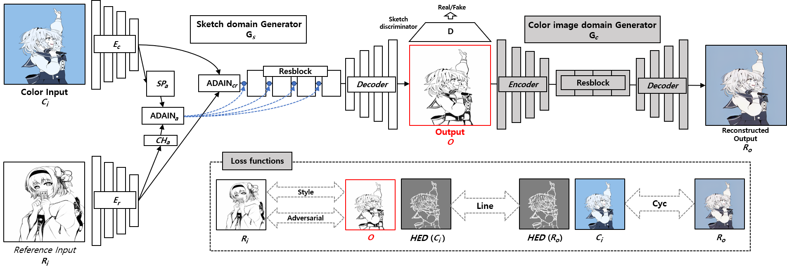

# Greyscale Image Processor (Sketch Generator)

This repository takes an image as input and outputs a greyscale "sketch" of the image. It provides a web-based HTML endpoint for easy testing.

## This branch is a standaloe app

- Converts the image to a greyscale sketch.
- Using Gradio
- Gpu docker container setup

# Architecture




# UI 


## Source

This repository is a clone of [https://github.com/Chanuku/semi_ref2sketch_code](https://github.com/Chanuku/semi_ref2sketch_code).

## How to Run

```bash
Run Docker Container:
- docker build -t img2sketch .
- docker run --gpus all -p 8073:8073 -it img2sketch
```