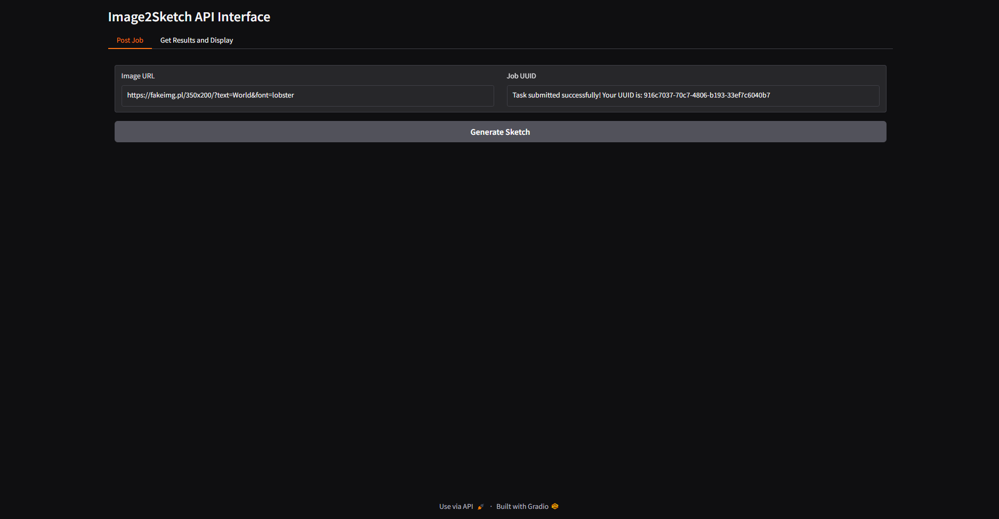

# What is gradio_ui

    Gradio_ui for testing (Image to Sketch)

# Dependent services

**This must be in docker-compose.yml other can be commented out**

- image2sketch-job-scheduler
- image2sketch
- image2sketch_network

# How to Run

`docker-compose up --build`

# How to use gradio_ui

- Run UI at `http//:localhost:8073`
- Past the link of the image you want to process in the `ImageURL` field
- Click the Generate Sketch button and Copy UUID from the `Job UUID` field
- Click on `Get Results and Display` tab
- Paste the UUID in the `UUID` field
- Click the `Check Job Status` button (Might need to check the status multiple times)
- If the `Zip File URL` field holds `Json` eg `{"ZipFileUrl": "SomeURl"}`.
- Click the `Download and Show Images` button

# Ui Sample

Jot something down

